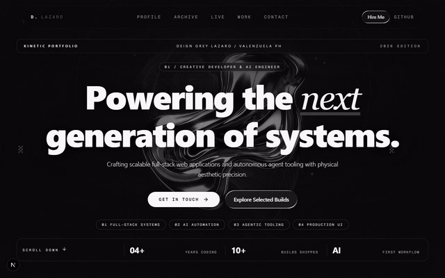

<p align="center">
  
</p>

<h1 align="center">Deign Lazaro — Spatial Portfolio</h1>

<p align="center">
  <strong>Full-stack portfolio in motion — live systems, not mockups.</strong><br/>
  Next.js 16 • React 19 • TypeScript • Firebase • Live on Vercel.
</p>

<p align="center">
  <a href="https://github.com/Deign86/deign-lazaro-dev/stargazers">
    
  </a>
  <a href="https://github.com/Deign86/deign-lazaro-dev/commits/main">
    
  </a>
  
  
  
</p>

<p align="center">
  <a href="https://deign-lazaro-dev.vercel.app">Live Site</a> •
  <a href="#live-systems">Live Systems</a> •
  <a href="#features">Features</a> •
  <a href="#tech-stack">Tech Stack</a> •
  <a href="#getting-started">Getting Started</a>
</p>

<br/>

<p align="center">
  
</p>

<p align="center">
  <em>Smooth-scroll tour of the motion-heavy portfolio, recorded from the live site. Static fallback: <a href="public/preview/portfolio-hero.png">portfolio-hero.png</a></em>
</p>

<br/>

## What is this?

An animated, monochrome spatial portfolio with live GitHub integration (ISR, refreshed hourly) and **6 production deployments** actively serving users. The portfolio UI uses a **screenshot gallery** — no embedded live iframes — and the hero tour above is a **recorded GIF**, re-capturable at any time via the scripts in `scripts/`.

- **Motion-first** — scroll-driven spatial scenes, staggered reveals, liquid-glass UI
- **Screenshot-first previews** — every deployment ships a static thumbnail, never a fragile iframe embed
- **Live data** — GitHub REST API with ISR (`revalidate = 3600`)
- **Responsive** — desktop 1280px captures, mobile-tuned layouts

---

## Live Systems

> Every system below is live — click through to try them. MathPulse shows its login wall (app interior needs demo credentials).

| System | Stack | Links |
| ------ | ----- | ----- |
| **MathPulse AI** | Next.js, TypeScript, FastAPI | [Live](https://mathpulse-ai-2026.web.app/) • [Repo](https://github.com/Deign86/mathpulse-ai) |
| **VServe** | Flutter, Dart, Firebase | [Live](https://v-serve-arta-feedback.vercel.app) • [Repo](https://github.com/Deign86/v-serve-arta-feedback-analytics) |
| **GameCon System** | Vite, React, Firebase | [Live](https://playverse-ops.vercel.app) • [Repo](https://github.com/Deign86/gamecon-system) |
| **Digital Classroom** | Next.js, TypeScript, Firebase | [Live](https://digital-classroom-reservation-for-plv.vercel.app) • [Repo](https://github.com/Deign86/digital-classroom-assignment-for-plv-ceit-bldg--with-backend-) |
| **Zhi Wei Zai** | HTML, Tailwind, Firebase | [Live](https://zhi-wei-zai.vercel.app) • [Repo](https://github.com/Deign86/zhi-wei-zai) |
| **APG Website** | HTML, CSS | [Live](https://apg-website-alpha-gamma.vercel.app) • [Repo](https://github.com/Deign86/apg-website) |

---

## Features

### Spatial scroll experience

Scroll-driven portfolio scenes with springs and parallax (Framer Motion), reduced-motion respected. Captured above as a single smooth descent — see `scripts/record-smooth-scroll.mjs`.

### Screenshot gallery (no live iframes)

`src/components/Deployments.tsx` renders a static per-project gallery from `public/screenshots/projects/`, with plain **Visit live** + **GitHub** links. The old `LivePreview` iframe carousel (`src/components/ui/live-preview.tsx`, `/api/live-preview`, `/api/embed`) is no longer mounted — static screenshots replace embedding entirely.

### Project cards

Editorial cards (`ProjectCard.tsx`) with tilt spotlight, tags, and deployment status, sourced from the single source of truth `src/data/projects.ts` (`PINNED_PROJECTS`).

### Resume & contact

Resume/experience section plus contact form and links (Viber, LinkedIn, WhatsApp).

---

## Tech Stack

| Layer | Technology |
| ----- | ---------- |
| Framework | Next.js 16 (App Router) |
| UI | React 19, TypeScript, Tailwind CSS v4 |
| Motion | Framer Motion 12 |
| Data | GitHub REST API (ISR, 1h) |
| Capture | Playwright 1.62 + ffmpeg (palette GIFs) |
| Deployment | Vercel |

---

## Getting Started

### Prerequisites

- Node.js 18+
- npm / yarn / pnpm / bun
- `ffmpeg` on PATH (only for GIF regeneration)
- Playwright chromium (only for re-capture): `npx playwright install chromium`

### Installation

```bash
git clone https://github.com/Deign86/deign-lazaro-dev.git
cd deign-lazaro-dev
npm install
npm run dev
```

Open [http://localhost:3000](http://localhost:3000).

### Environment

Optional GitHub token (raises API limit from 60/hr):

```env
GITHUB_TOKEN=your_token_here
```

ISR cadence lives in `src/app/page.tsx`:

```typescript
export const revalidate = 3600; // seconds (1 hour)
```

---

## Re-capturing previews

```bash
# Smooth-scroll hero tour (one continuous descent) + GIF
node scripts/record-smooth-scroll.mjs
ffmpeg -y -ss 3 -t 19 -i public/preview/portfolio-hero-smooth.webm \
  -vf "fps=8,scale=800:-1:flags=lanczos,palettegen" /tmp/pal.png
ffmpeg -y -ss 3 -t 19 -i public/preview/portfolio-hero-smooth.webm -i /tmp/pal.png \
  -lavfi "fps=8,scale=800:-1:flags=lanczos [x]; [x][1:v] paletteuse" \
  public/preview/portfolio-hero.gif

# All six live systems (static PNG screenshots)
node scripts/record-live-systems.mjs
```

Targets: hero GIF 800px / 8fps / ≤5MB; system shots 1280px PNG. System PNGs land in `public/screenshots/projects/` and are wired as `thumbnail` in `src/data/projects.ts`.

---

## Project Structure

```
deign-lazaro-dev/
├── src/
│   ├── app/                  # Next.js App Router (page.tsx, layout, api/)
│   ├── components/           # Hero, Projects, Deployments (screenshot gallery),
│   │                         # ProjectCard, Resume, Contact, SpatialPortfolio
│   ├── data/projects.ts      # PINNED_PROJECTS — single source of truth
│   └── lib/                  # github.ts, resolve-live-url.ts, vercel.ts, utils.ts
├── public/
│   ├── preview/              # Hero tour GIF + webm source + PNG fallback
│   └── screenshots/projects/ # Static per-project thumbnails used by the UI
├── scripts/
│   ├── record-smooth-scroll.mjs   # Hero tour (this README's GIF)
│   ├── record-live-systems.mjs    # 6 systems: static PNG screenshots
│   └── capture-*.ts               # Legacy still-capture scripts
└── remotion/                 # Promo video project
```

---

## Customization

- **Showcased projects** — edit `PINNED_PROJECTS` in `src/data/projects.ts` (title, description, tags, `githubRepo`, `liveUrlCandidates`, `thumbnail`).
- **Thumbnails** — drop a PNG in `public/screenshots/projects/<id>.png` and point `thumbnail` at it.
- **Theme** — CSS variables in `src/app/globals.css` (`--mono-*`).
- **GitHub feed** — `CUSTOM_DESCRIPTIONS` / `EXCLUDED_REPOS` in `src/lib/github.ts`.

---

## Author

**Deign Lazaro**

- GitHub: [@Deign86](https://github.com/Deign86)
- Portfolio: [https://deign-lazaro-dev.vercel.app](https://deign-lazaro-dev.vercel.app)
- LinkedIn: [Deign Grey Lazaro](https://www.linkedin.com/in/deign-grey-lazaro-2976a41b6/)

Built with Next.js, React, and TypeScript. The hero tour is a recorded GIF and system previews are static screenshots — click through to the live systems.
